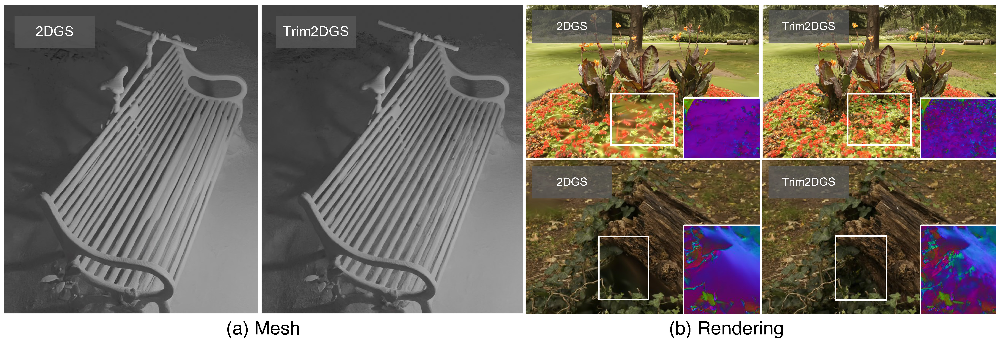

# Trim 3D Gaussian Splatting for Accurate Geometry Representation


More demonstrations can be found on our [project page](https://trimgs.github.io/).

## Updates

- [24-06-18] The code of Trim3DGS is released. See [Trim3DGS Instruction](Trim3DGS/README.md)

## Usage

```bash
git clone git@github.com:YuxueYang1204/TrimGS.git --recursive
```
Then follow the [Trim3DGS instruction](Trim3DGS/README.md) to install the dependencies and prepare the dataset.

**Note:** We modify the differentiable rasterization kernel to support contribution-based trimming, which can be found in [diff-gaussian-rasterization (for Trim3DGS)](https://github.com/Abyssaledge/diff-gaussian-rasterization) and [diff-surfel-rasterization (for Trim2DGS)](https://github.com/YuxueYang1204/diff-surfel-rasterization).

## Todo

- [x] Release the code of Trim3DGS.
- [ ] Release the code of Trim2DGS and unify the dependencies of Trim3DGS and Trim2DGS (in one week).
- [ ] Integrate TrimGS into more methods such as [GOF](https://niujinshuchong.github.io/gaussian-opacity-fields/).

## Acknowledgements

We sincerely thank the authors of the great works [3D Gaussian Splatting](https://repo-sam.inria.fr/fungraph/3d-gaussian-splatting/) and [2D Gaussian Splatting](https://surfsplatting.github.io/). Our Trim3DGS and Trim2DGS are built upon these foundations.
